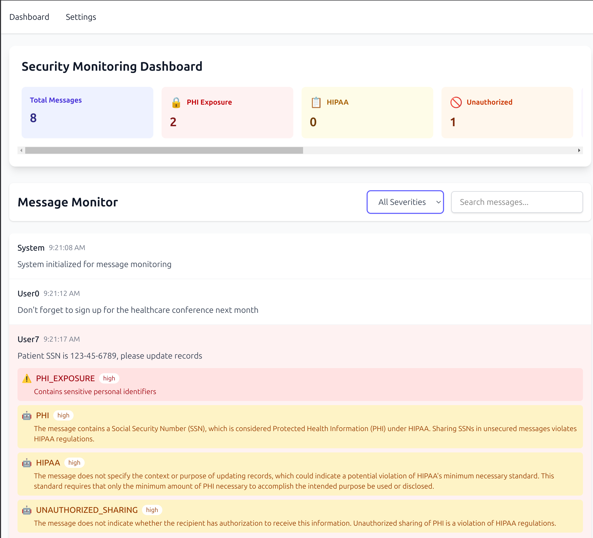

# TS Router Demo (Security Monitoring App)

This app uses ollama to monitor incoming messages for PHI and other HIPAA violations.  
It was a fun project to try out https://github.com/TanStack/create-tsrouter-app.



##  Getting Started

To run this application:

```bash
bun install
bun start
```

## Architecture

The app simulates incoming messages. It separates the rate of incoming messages from the rate of messages being classified.

This app uses the following technologies:

- React
- TailwindCSS
- TanStack Router
- TanStack React Store
- Ollama

